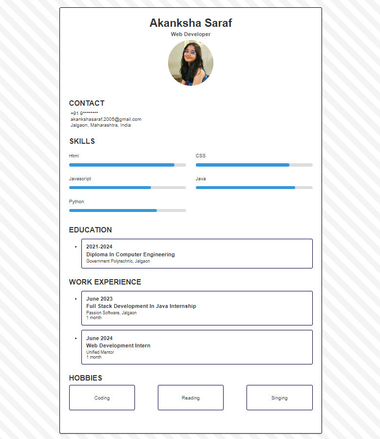

 ## Description

This project outlines a responsive resume template styled with CSS, featuring sections for personal details, contact information with Font Awesome icons, a skills section with visual bars, educational history, work experience listings, and hobbies. The design employs a clean layout with a white background, bordered container, and subtle box-shadow for depth, ensuring readability and professional presentation. The template is structured to adapt well to various screen sizes, maintaining its clarity and organization.

# Screenshots

## Features

- Clean and responsive design
- Skills section with animated skill bars
- Contact information with icons
- Education and work experience sections
- Hobbies section with interactive hover effects

## Author

Akanksha Saraf

